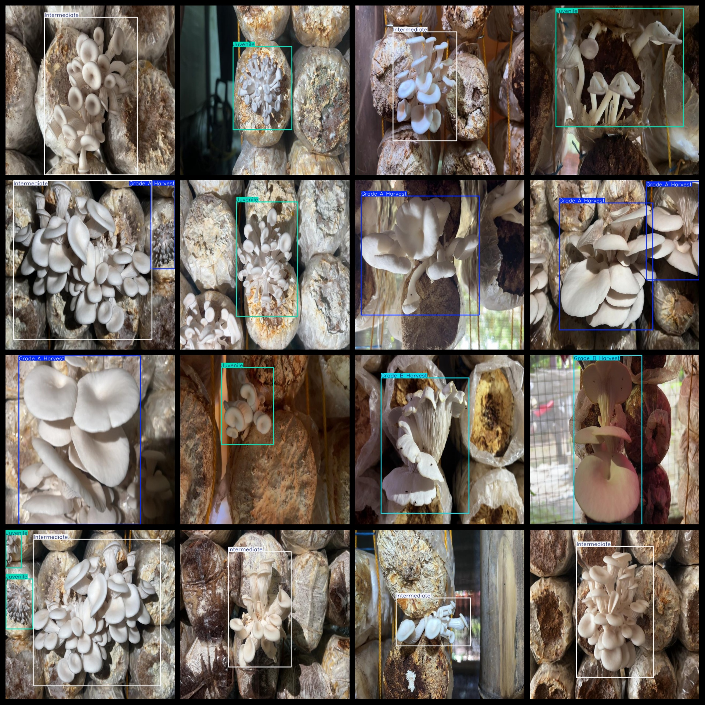
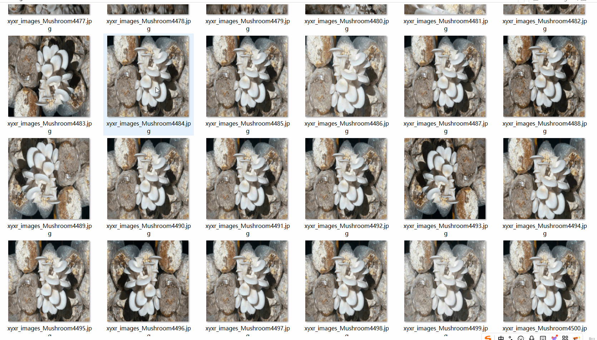

# Mushroom Growth Stage Dataset - 7259 Images in VOC+YOLO Format

The mushroom growth stage dataset consists of 7259 images in VOC and YOLO format, organized into three folders for image storage, XML annotation files, and txt labels. The JPEGImages folder contains a total of 7259 jpg images. The Annotations folder has an equal number of XML files, totaling 7259. The labels folder also includes a total of 7259 txt files.

The number of label categories is four: "Grade A Harvest", "Grade B Harvest", "Intermediate", and "Juvenile". Each category has its own set of bounding box numbers, which are as follows:

- Grade A Harvest: 1970 bounding boxes
- Grade B Harvest: 1092 bounding boxes
- Intermediate: 3282 bounding boxes
- Juvenile: 2190 bounding boxes

The total number of bounding boxes is 8534.

The images have a clear resolution with a resolution of pixels. They were enhanced for training purposes.

The shape of the labels is rectangular boxes, designed for object detection and recognition.

Important Notes: There are no guarantees regarding the accuracy or precision of the models trained on this dataset or any associated weights files. This dataset provides accurate and reasonable annotations only.

Annotations and Image Details:

## Images

---

Here is a pay link on Stripe (https://buy.stripe.com/3cs8yP7sY87d0vu9AB). Please contact me lonlonago@foxmail.com after funding $89, and I will send you a complete data files, thank you!

